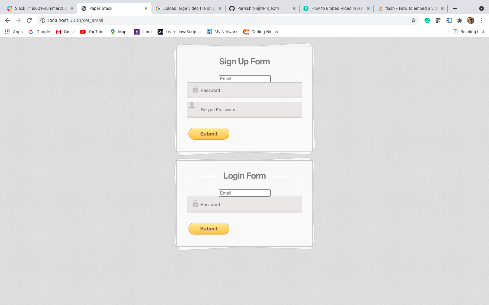

# Project 4 (PFA Videos in the readme.md)

## Description
This project is part of Final Assessment IS601 that encapsulates Python, Flask, SQLAlchemy, Redis Session Management, Docker and Shell scripting. 

# Working Project Video
<h2><a href="https://drive.google.com/file/d/1o-FDVQjlm_WarR_1Ofbp4dkOaN2kBO7x/view?usp=sharing">Project Working Video Link</a><h2> 

## How to run ?

  <ol>
    <li><h3>Using Shell Script</h3>
<ul>
<li>Clone this repository</li>
<li>Run command in the terminal: <code>sh mac.sh</code></li>
</ul>
    </li>
    <li><h3>Using Docker</h3>
<ul>
  <i><b>Note: Docker file is in flask_app folder</b></i>
<li>Clone this repository</li>
<li>Open using Pycharm</li>
  <li>Add Docker Configuration using 'Edit Configuration'</li>
  <li>Set File Path to Dockerfile</li>
  <li>Run the Project</li>
</ul>
    </li>
  </ol>

  
  
## Videos
<ul>
  <li><h3>Add Record Video</h3>
    
This video shows adding of record to the database. It uses the <i>POST</i> endpoint /address/new.
 
    
  https://user-images.githubusercontent.com/81203429/127776752-2400b791-adb3-482d-a5ab-8f3392d50b8d.mov
  
  </li> 
  <li><h3>Edit Existing Record Video</h3>
    
This video shows edit of an existing record in the database. It uses the <i>POST</i> endpoint /edit/<int:address_id>.
 
    
https://user-images.githubusercontent.com/81203429/127777029-7a647388-5063-4043-b8f9-191e03609ad8.mov
  
  </li> 
  
  <li><h3>Delete Existing Record Video</h3>
    
This video shows delete of an existing record in the database. It uses the <i>POST</i> endpoint /delete/<int:address_id>.
 
    
https://user-images.githubusercontent.com/81203429/127778771-22b2f248-b514-4d5c-946d-a249739495e5.mov
  
  </li> 
  
   <li><h3>Sign-In</h3>
    
This video shows sign-in using email in login form. It makes use of session cookie that gets stored in the browser.
 
    
https://user-images.githubusercontent.com/81203429/127939677-7cdacdd5-704f-4d39-9358-bc0a5f083e86.mov
     
  </li> 
  
   <li><h3>Sign-Out</h3>
    
This video shows sign-out using delete of session. It makes use of removal of session cookie stored in the browser. Once the session is deleted, the user cannot navigate to any end point without signing-in again.
 

https://user-images.githubusercontent.com/81203429/127779010-eddcbe36-5382-478f-8810-01290d384ce4.mov
     
  </li> 
  
   <li><h3>View Session Info in UI and Session Cookie in Developer Tools</h3>
     
This video shows the session test variable in UI and session cookies that gets stored in developer tools upon sign-in.

     
 https://user-images.githubusercontent.com/81203429/127939899-ed92c1ef-3b80-43cd-9466-f5d5ad12b263.mov
     
     
  </li> 
  
 
  
</ul>
  

## Screenshots
<h3> Docker Running </h3>

</img>

 

<h3> Sign-up:Sign-In </h3>

</img>

 

<h3> Session Cookie in Developer Tools </h3>

</img>

 

<h3> Postman Listing All Records </h3>

</img>

 

<h3>HTML Page Listing All Records</h3>
</img>

<h3>Postman Showing One Record with a Get Request</h3>
</img>

<h3>HTML Page Showing One Record with a Get Request</h3>

</img>

<h3>Postman Showing Creation of Record</h3>
<h4>Request Screenshot</h4>

</img>

<h4>Response Screenshot</h4>

</img>
                                                   

<h3>HTML Showing Creation of Record</h3>
<h4>Response Screenshot</h4>

</img>
                                                   

<h3> Postman Showing Edit of Record </h3>
<h4>Request Screenshot</h4>

</img>
 

<h4>Response Screenshot</h4>

</img>

 

<h3> HTML Showing Edit of Record </h3>

</img>

 

<h3> Postman Showing Delete of Record </h3>
<h4>Request Screenshot</h4>

</img>
 

<h4>Response Screenshot</h4>

</img>

 

<h3> HTML Showing Delete of Record </h3>

</img>

 

  
  

